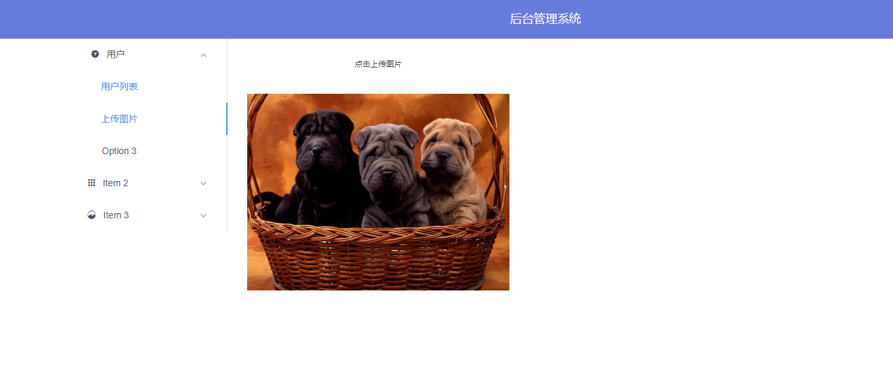

# 基于 koa2 & mongoose & vue & iView 的全栈式开发demo

## node版本要求：
由于Koa2 使用了异步函数，其中Node.js版本要求不能低于v7.6.0

## 操作步骤：
* 地址栏输入localhost:8080
* 初次进入需要注册账号，注册成功之后跳转到登录页面
* 输入刚刚注册的用户名及密码
* 登录成功后进入主页

## 功能：
* 后台基于koa2  busboy异步上传图片的实现，基于mongoose 操作数据库
* 前台基于vue & iView 实现页面交互

## 在线预览




## 运行项目
```javascript
//第一步
cd koa2-vue-demo
//第二步
npm install
//第三步
npm run dev
//第四步:启动mongodb
mongod
//第五步
npm run _server:dev
```
